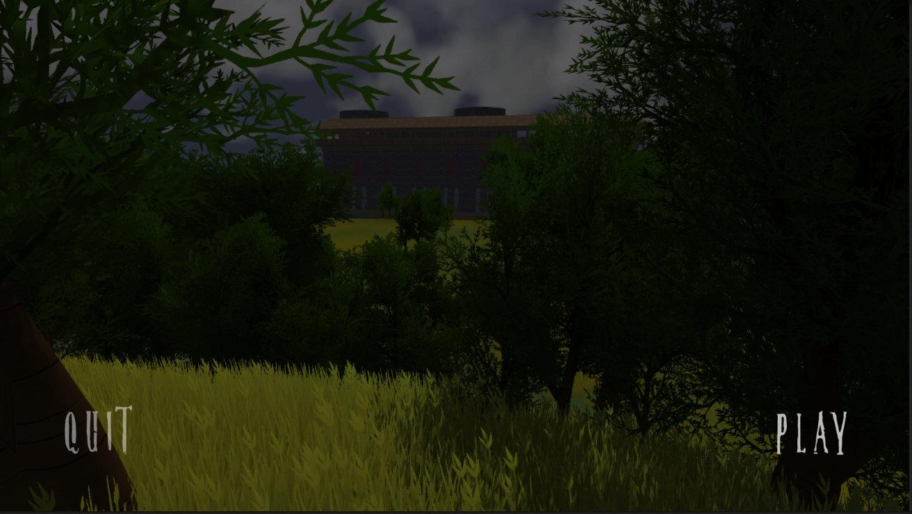
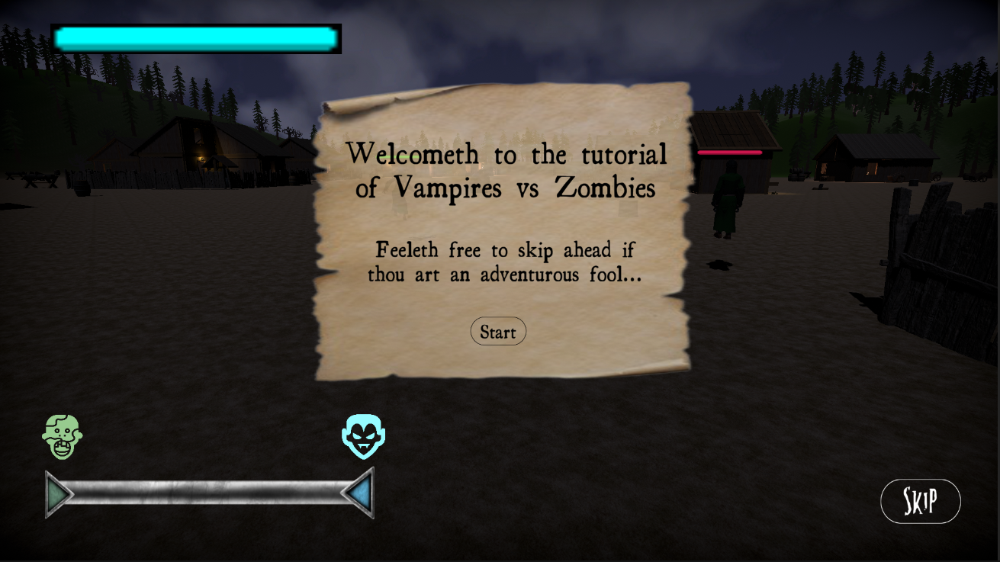
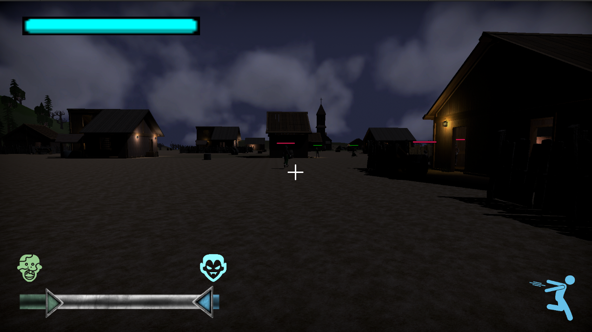
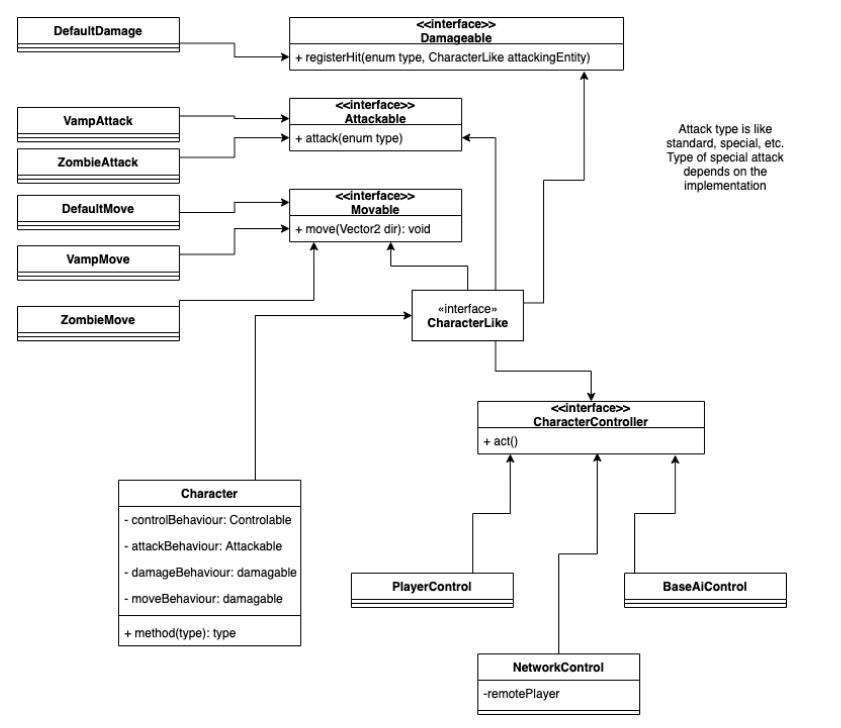
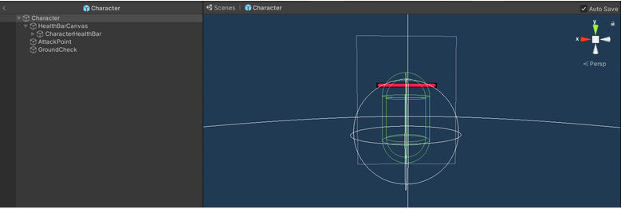
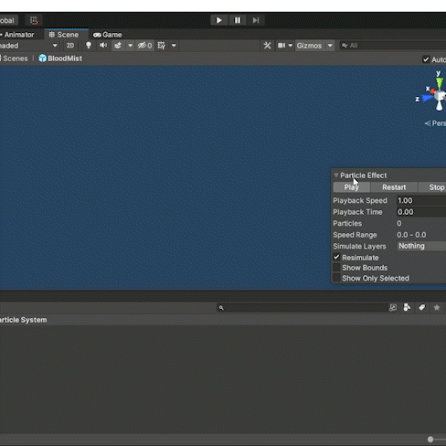
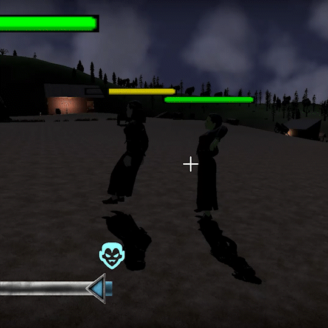
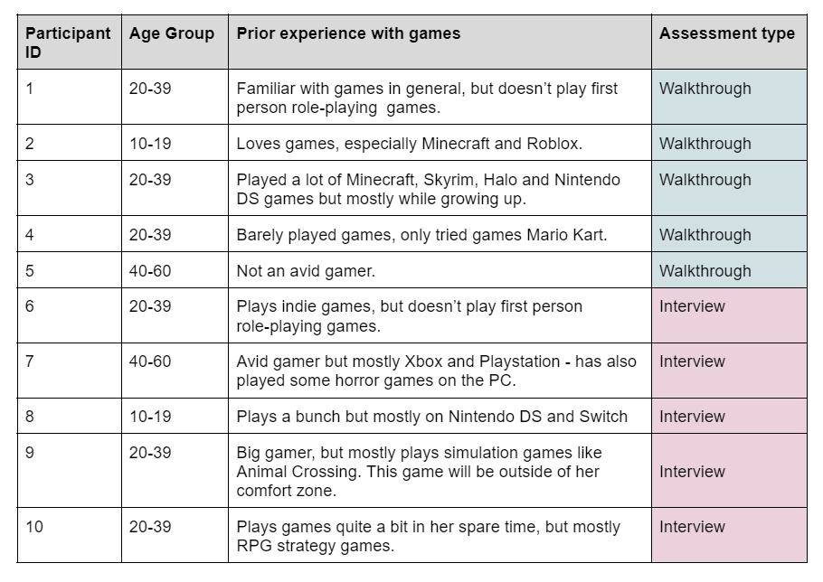
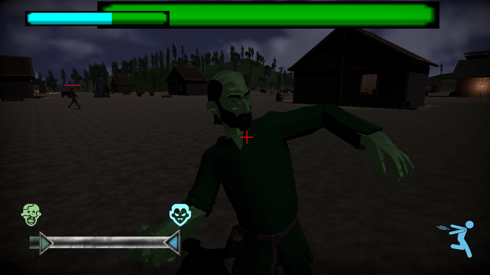

[](https://classroom.github.com/online_ide?assignment_repo_id=445351&assignment_repo_type=GroupAssignmentRepo)


**The University of Melbourne**
# COMP30019 – Graphics and Interaction – Project 2

## Table of Contents
* [Team Members](#team-members)
* [Vampire vs Zombies: Game Overview](#vampires-vs-zombies)
    * [Game Controls](#game-controls)
    * [User Interface](#user-interface)
* [Behind the Scenes](#behind-the-scenes)
    * [The Graphics Pipeline](#the-graphics-pipeline)
    * [Camera Motion](#camera-motion)
    * [Procedural Generation](#procedural-generation)
    * [Shaders](#shaders)
    * [Particle System](#particle-system)
* [Game Evaluation](#game-evaluation)
    *  [Participants](#participants)
    *  [Methodology](#methodology)
    *  [Summary of Feedback and Changes Made](#feedback-changes)
* [References](#references)

</br>

## Building/Running the game in Unity
* Uses Unity version 2021.1.13f1
* Make sure you are in the `Menu` scene when starting the game in the Unity Editor.
* Make sure both `Menu` and `MainScene` are saved in build preferences, with `Menu` having index 0 and `MainScene` having index 1 (This _should_ already be set).
* If you’re using Windows, please ensure that you are running `OpenGL Core` instead of Direct3D11 (This _should_ already be set in Project Settings -> Player).

</br>

## Team Members
* Wen Yee Ang (980036)
* Ivy Brain (1084265)
* Alice Tai (1081512)
* Julie Zenou (993618)

### Member Contributions
| Name | Task | 
| :---         |     :---      |  
| Wen Yee Ang  | * Terrain design, lighting design, house and in-game objects design.<br>* User controls and camera controls.<br>* Particle system.<br>* Special abilities implementation (activated by space bar), and special abilities cooldown indicator UI.<br>* Player UI (alongside Julie), specifically the health bars and progress bar.<br>* Optimisation changes (alongside Ivy).<br>* Game evaluation. | 
| Ivy Brain    | * AI algorithms for villagers, vampires and zombies.<br>* Implemented player controllers.<br>* Shaders (bump map shader and sparkles).<br>* System architecture design.<br>* Implementation for paralysing and reactivating characters (part of infection). |
| Alice Tai    | * Procedural generation.<br>* Environment modelling and sound.<br>* Implemented mutation script (triggering shaders to change a villager’s appearance to a zombie or vampire).<br>* Video editing.<br>* Game evaluation.|  
| Julie Zenou  | * Game menus including the initial start menu, choosing player and difficulty menu, pause menu and any end of game menus.<br>* Player UI created along with Wen.<br>* The tutorial.<br>* All character animations.<br>* Game Evaluation.|

Please note that this project was extremely collaborative, and our team worked together closely to implement and debug each others’ assigned features, so this list of contributions is by no means exhaustive. 

</br>

<a name="vampires-vs-zombies"></a>
# Vampires vs Zombies: Game Overview

_For centuries, the vampires has't reined over the tiny village in Pillar Planes. While the villagers struggl'd to maketh dinn'r, the vampires rarely wenteth unfullfill'd. Until… One night, a swarm of zombies hath appeared! Those gents did attack and feast'd on the luscious flesh of the humans. This. meaneth. WAR.
Vampire vs Zombies is a first person perspective satirical horror game where you can choose to play as either a vampire or a zombie and fight for control of the village!_

Infect as many villagers as possible in order for them to join your side, while making sure the enemy isn't getting ahead! Win the game by having more of your own kind once the villagers have all been consumed... but beware, the enemies can infect villagers too, and they'll attack you if you get too close!

You can choose to play in either Easy or Hard Mode. Discover the benefits and shortcomings of playing as either a vampire or a zombie, take over the village and declare your dominance!

_Shall thee dareth to taketh ov'r the village?_

`Video Game Trailer:` https://www.youtube.com/watch?v=v6e4xVm8CA4

<br>

## How to Play
<a name="game-controls"></a>
### Game Controls
This game is recommended to be played on a laptop with a mouse - it supports both Windows and iOS. 

For the menu components, move your mouse to go between options and click to select.

In-game controls include:
- Move your mouse to look around.
- Use WASD or arrow keys to move your character.
- Left click to attack. 
- Press the spacebar to activate your character’s special ability.
- Stand still for at least 3 seconds to regain health.
- Press the ESC key to pause the game, where you can also adjust the volume of the game, light intensity and mouse sensitivity. 

When a character drops to zero health, they will get infected if they’re a villager, or die if they’re a zombie or vampire.

Special abilities activated by the spacebar include:
- Leaping, allowing you to cover greater distances faster if you play as a vampire.
- Stunning, allowing you stun groups of enemies and villagers for short amounts of time if you play as a zombie.

The special abilities have a cooldown period so they cannot be used all the time. 

<br>

<a name="user-interface"></a>
## User Interface
When opening the game, a player will be greeted by the start menu, where they can choose to play or quit the game (shown below) by clicking. After clicking play, and then selecting between Vampire or Zombie and Hard Mode or Easy Mode, the player will press play again to start the game. If the player does not make any selection, the default settings are applied.

<br>
<p align="center">
  
    <br>
    <i>Figure 1: Start Screen</i>
</p>

When the game starts, there will be a tutorial detailing the background story to the game which players can choose to read through or skip (shown below). The tutorial also includes a brief explanation of the game controls, UI elements and the winning condition.

<br>
<p align="center">
  
    <br>
    <i>Figure 2: Tutorial on the player's screen</i>
</p>

Once the tutorial is finished (or skipped), the player can begin the game! 
<br>
<p align="center">
  
    <br>
    <i>Figure 3: UI on the player's screen</i>
</p>

In-game, the Player’s UI includes:

- `Health Bar` (top left corner)
    - This tracks the player's health so they know if they’re close to dying or not.
- `Progress Bar` (bottom left corner)
    - This tracks the progress of the zombies and the vampires.
    - As more villagers are infected and turned, that side will increase e.g. as there are more zombies in the game, the green will fill more of the bar.
- `Special Ability Cooldown UI` (bottom right corner)
    - When the powerup is available, it will be fully visible. After a player has used the special power, it will disappear and slowly fill up until it is fully visible again to indicate to the player that they can use that power again.
- `Crosshair` (middle of the screen)
    - This helps to orient the player. It will turn red when a target is in range to attack. 

<br>

Part of our game design includes having consistent colours for each side, in order to allow the player to distinguish between them easily. This is reflected in the special power icon and in the health bars - both for players and for the other characters in the game.

Every non-playable character (that is alive) has a health bar above their head and the colour of the health bar distinguishes what they are:

- **Red**: Villager
- **Green**: Zombie
- **Blue**: Vampire

Stunned characters have yellow health bars.

<br>

## Behind the Scenes
### Object and Entity Design
#### System Architecture Design
We opted to use **composition** over inheritance in our project, as its runtime flexibility was well-suited to our game concept - similar characters with a few different traits, with characters changing states and behaviours when infected. Guided by this principle, and considering the fundamental differences that our characters could have from one another, we produced a UML diagram to guide the development process (Figure 4).

<br>

<p align="center">
  
  <br>
  <i>Figure 4: UML diagram</i>
</p>

<br>

We envisaged a `controller` which could be assigned to a character and would determine the actions it takes - allowing the same character to either be controlled by a player, an AI, or a remote network player if we had been able to implement multiplayer.

It also allowed for the different states: vampires, villagers, and zombies, to be easily defined by setting or modifying specific behaviours, without having to modify the base character class. The modular nature also allowed for the player to easily choose to play as a vampire or a zombie without modification to the code.

While we evolved on this design, creating some new classes where more granular behaviour was needed and removing some where the differences between them were simple and easily set by a constructor, we stood by these principles. This allowed us to easily modify functionality and add new features without affecting unrelated code, which greatly aided our collaboration.

<br>

#### Graphical Design
Our game's graphical style adopted a medieval theme, where elements in the village consisted of typical medieval objects like wooden houses, wells, wagons and so on.

The atmosphere we wanted to evoke was a grim and foreboding one, supplemented by ominous background music, a perpetually nighttime environment and dim lighting.

The template used for our characters was based on a human model we found from the Asset Store.

Since our game is based on the premise that all villagers started off as humans but then turned (or will turn) into either zombies or vampires, we created different textural appearances and special effects to be applied on top of the human models to differentiate between the two. When villagers are infected, there is a slow transition effect to reflect this phenomenon.

<br>

#### Objects and Entities
_Vampires vs Zombies_ primarily takes place in a single MainScene, with the only other scene being a MenuScene which houses our starting screen. 

The most significant game objects in MainScene are as follows:

- The villagers, enemies and the player are generated by a script attached to the **GameManager** game object at runtime, using a Character template.

- The **Character** prefab only includes the health bar and character controller; the models themselves are randomly chosen from a set of available models.

<br>
<p align="center">
  
    <br>
    <i>Figure 5: Character prefab</i>
</p>

- The village (which is the player’s main gameplay environment) is procedurally generated by a script attached to the **Village** game object at runtime, with all generated game objects (representing houses, fences and other environmental objects) becoming its children.

- A separate **UI Canvas** game object contains all entities associated with the player’s user interface, such as the player’s health bar, progress bar, special ability cooldown indicator and pause menu.

- A **NightEnvironmentPostProcessing** game object which manages all post-processing aspects of the camera.

<br>

#### Gameplay Design

Players have the option of choosing between a variety of game settings, including game difficulty, whether their character is a vampire or zombie, and other in-game customisations such as audio volume and mouse sensitivity.

In order to balance the game’s enemies and differentiate between gameplay as a vampire and as a zombie, we designed zombies and vampires as such:

- Zombies have the advantage of hitting harder, but move slower.
- Vampires have the advantage of moving faster and having more health, but don’t deal as much damage.
- When playing as a vampire, the player has the special ability to leap.
- When playing as a zombie, the player has the special ability to stun groups of enemies.

Whichever side the player ends up selecting, all the other characters in the game would be controlled by AI designed to have the typical movement styles and behaviours of vampires, zombies or villagers.

<br>

The game’s difficulty included an Easy Mode, and a Hard Mode, with Hard Mode designed as follows:

- More enemies would spawn.
- Both enemies and villagers move faster and have a higher starting health.
- Enemies deal more damage.

While Easy Mode was designed to be for complete beginners, the Hard Mode targets those with plentiful gaming experience and proficiency.

<br>

## The Graphics Pipeline

We used Unity’s **Built-in Render Pipeline** for this project alongside our custom shaders and other changes to increase optimisation.

#### Render Pipeline Settings
We opted to use the **deferred rendering path** instead of the default forward rendering path. The deferred rendering path first renders each surface into a geometry buffer, before then shading in each pixel in a later lighting pass. This means that the rendering time depends on the number of pixels illuminated rather than the number of light sources (which is the case with forward rendering). 

We chose deferred rendering because it is more efficient in circumstances where there are many light sources interacting with multiple objects. With Vampires vs Zombies being a satirical take on horror tropes, the game depends on dim lighting and lots of light sources to create a gloomy, horror-esque atmosphere. Thus, deferred rendering cuts down on the rendering cost.

The graphics pipeline has the following stages:

1. **Culling** 
  - This project made use of the default **frustum culling** already implemented by Unity.
  - For frustum culling, which only renders objects visible to the camera, we significantly improved the FPS by setting Far “Clipping Planes” to 250 instead of the default 1000 for the Main Camera. As our game is in first person, and the player is generally limited to a fairly small area, a 250 word unit range is more than sufficient.

2. **Rendering** 
  - **Standard Shaders**:
    - We used Unity’s Standard Shader to render in-game objects such as houses and trees (imported from the Unity Asset Store). 
  - **Custom Shaders**:
    - The character models in game are first rendered via a combination of custom shaders, which allows for a seamless transition from a villager’s appearance to a zombie’s or vampire’s appearance after the villager is infected.
    - A shader for the skin, consisting of a custom vertex and fragment shader, runs first - transitioning into the correct skin colour and providing other zombie and vampire-specific special effects.
    - A shader for the clothes, consisting of a modified version of the surface shader provided with the models, runs second. This overlays clothes with the correct colours, and can transition between clothing colours, but leaves the skin transparent so the first material shows through.
Lighting: 
    - As many point lights are used in the game, this can be expensive to render. Thus, some optimisations were made to reduce the cost, such as marking certain light sources as “Not Important” and having all point light sources not cast shadows.

3. **Post-processing**
  - We also took advantage of Unity’s post-processing effects by attaching a post-process layer to the main camera. The effects applied included:
    - Colour grading, where brightness, contrast, and white balance were tweaked to create a darker, gloomier atmosphere.
    - A vignette, applied to create slightly darkened edges around the camera view to add to the sense of gloominess. 

<br>

## Camera Motion
We decided to implement a First Person camera for Vampires vs Zombies for the following reasons:
- Increased immersion.
- Limited perception of the environment increases the difficulty of gameplay and adds atmospheric tension (for example, the player will be unable to perceive enemies sneaking up on them from behind).
- Allowing the player to have near-full control of the camera.
 
The camera is controlled by the player’s mouse input with the following code: 
```c#
// Get mouse input
float mouseX = Input.GetAxis("Mouse X") * PlayerVariables.mouseSensitivity * Time.deltaTime;
float mouseY = Input.GetAxis("Mouse Y") * PlayerVariables.mouseSensitivity * Time.deltaTime;

// Rotate player to 'look' left and right
player.Rotate(Vector3.up * mouseX);

// Increase xRotation every frame based on mouseY
xRotation -= mouseY;
xRotation = Mathf.Clamp(xRotation, -60f, 45f); // clamp rotation values

// Rotate camera up and down
transform.localRotation = Quaternion.Euler(xRotation, 0f, 0f);
```
 
As seen above, moving the mouse upwards and downwards will rotate the camera accordingly along the x-axis, which will create the effect of looking “up” and “down”. The rotation values have been clamped to 45 degrees downwards and 60 degrees upwards to prevent the rotation from feeling too unnatural.

Moving the mouse right and left will rotate the player’s position along the y-axis. As the camera is attached to the player’s “head” as a child GameObject, the camera will also turn to “look” in the respective direction the player is facing. Similarly, the camera moves when the player moves, creating a seamless first person experience. 

The extent of how much the camera rotates per given mouse movement is controlled by a mouseSensitivity value stored in a PlayerVariables static class. This value can be adjusted in-game via the pause menu in order to give players maximum control over their camera and its movement sensitivity.

When the player successfully infects a villager, the camera will detach from the player and zoom out to show the biting animation, to demonstrate the effect more clearly. When this happens, player control over the camera is overridden for a few seconds. 

Ultimately, using mouse input for camera control allows us to create a seamless first person player experience reminiscent of first person role-playing games. This allows the player to have near-full control over their camera while playing the game.
<p align="center">
    
    <br>
    <i>Figure 6: In-game camera motion and control</i>
</p>

<br>

## Procedural Generation
The game environment that was procedurally generated was the village. The algorithm used is loosely based on L-systems, where the village area is thought to be somewhat like an urban district, with blocks of houses separated by roads, and roads being split into smaller roads (see Figure x) . In our case, the element that was being subdivided was a block, represented with a rectangle, which would go on to be iteratively split into smaller blocks at a random interval. The smaller blocks would further subdivide, as long as they fulfilled a range of constraints. Those blocks then formed the basis for which houses and other village objects would spawn into.

The algorithm runs as follows:
1. The list of blocks to divide is initialised with a block representing the entire village area.
2. The list is iterated through, with each block verified whether they meet a set of constraints.
3. If the block is not of a minimum width and height, it would not be accepted and therefore not be allowed to continue splitting.
4. Otherwise, the block replaces its parent (if it has one).
5. The block is split either horizontally or vertically at a random interval and its two children blocks are added to the list, to be checked later on.
6. The algorithm stops when the list of blocks to check is empty. The final children, representing the smallest possible blocks that can be generated within their parent, are stored in a list with their geometry information, ready to be used for procedural spawning.

<p align="center">
  
      <br>
    <i>Figure 7: Procedural generation rough visualisation</i>
</p>

<br>

This type of algorithm was chosen primarily because its results resemble that of a typical city grid layout. Whilst it is common to grow roads instead of houses, our approach subdivides the village into blocks because our village does not necessarily have defined roads or paths, yet the placement of houses in each rectangular block should vary. It is from these grid blocks that the spawns of other village objects are calculated. For instance, houses with lamp posts spawn in the center of each block, and logs spawn on the top left.

<br>

## Shaders

Because we wanted our game to display smooth transitions when someone was infected, **we had to include the various effects we used in a single shader**. However **these effects are separate**, and could be split out and applied separately if we did not wish to utilize these smooth transitions.

Both these effects are implemented in "Vampires vs Zombies/Assets/Resources/Shaders/Villager.shader" (linked [here](https://github.com/Graphics-and-Interaction-COMP30019-2021/project2-project2_group_03/blob/master/Vampires%20vs%20Zombies/Assets/Resources/Shaders/Villager.shader)), inside the ```frag``` function.

This file also includes a vector shader to feed the required information to this fragment shader, and a surface shader modified from the one that was provided with the model. This renders the clothes in a separate pass after our custom shaders have rendered the skin and skin effects, but we modified it to be able to smoothly transition between clothing colours as well.

<br>

### Shader Description #1 - Bump Mapping

This effect is implemented in the code starting with the comment ```// Illumination + Bump map effect```.

We wanted zombie skin to have a bumpy texture, to look different and unnatural compared to smooth human skin. To this end we implemented a bump map, in combination with diffuse lighting adapted from Workshop 7.

Both this and the sparkle shader required a UV map for the model to be able to apply the effects across the skin. However this proved difficult, as the UV map provided with the character models had a single point for each body part - so it was not possible to apply an effect evenly across the whole skin. We could not modify this UV map, as the surface shader for the clothes relied on it, and while we investigated using different UV maps for different materials we could not get this to function properly.

As a substitute, we used screen coordinates - using the Unity function ```ComputeScreenPos``` based on the clip space vertex. While this was adequate for applying the effect, it has the side-effect of moving the effect along the skin when the camera moves, and distorting around surfaces that are not directly facing the camera. We decided that this was an acceptable compromise, as the added motion often enhanced the effect.

We found a bump map for concrete which we decided looked pretty good as bumpy zombie skin. When the character is a zombie, the bump effect activates and decodes a normal from the bump map using inbuilt Unity functions. The bump map does have to be sampled with a UV coordinate, and because this is on the character model we had the same issues as with the sparkle shader, and had to use screen coordinates. This creates a moving effect on the bump map. 

When sampling the bump map, the UV coordinates are divided by transWeight - the calculated value that goes from 0 to 1 through the course of the transition. At the start of the transition, transWeight is nearly 0, so the UV coordinates are made much larger - causing the bumps to appear very small on the skin.

As transWeight tends towards 1, the UV coordinates go closer to their normal size - this leads to the bumps ‘zooming in’ on the skin.

The normal decoded from the bump map is averaged with the calculated model normal from the vertex shader by summing them and then normalising the result. Before summing, the bump map normal is also multiplied by transWeight, so it has little effect at the start. This leads to the bumps fading in as well as zooming in, to create a smooth transition. 

After this a skin colour that is linearly interpolated between the original and the transformed colour with transWeight. This colour and the resulting normal is then used to calculate ambient and diffuse lighting, adapted from the code used in Workshop 7. This creates an evenly lit model with the bump effect which can transition in smoothly.

The bump map and skin change transition are demonstrated without the clothes or other body parts like hair on in the GIF below.

<p align="center">
  
    <br>
    <i>Figure 8: Zombie bump map shader in isolation</i>
</p>
<br>

<br>

### Shader Description  #2 (More Advanced) - Sparkles

This effect is implemented in the code starting with the comment ```//Sparkle effect```.

We wanted to make the vampire skin sparkly, because Twilight was the pinnacle of cinema. To this end we implemented an effect to add sparkles on a model.

When implementing the sparkle shader on this model, the same limitations regarding UV maps occured as with the bump map shader, so it utilises the same calculated screen space coordinates.

The sparkles were designed to slowly fade in and out in any given position. While this was initially accomplished by calculating the intensity using the sine of \_Time + u + v, the effect was very uniform; the sparkles moved across the model in a linear manner.

To counteract this and make the sparkles more random, a ‘seed’ was needed that would be fixed for each UV position. To implement this, a 900-element \_SPARKLESEED array was defined in the shader.

At runtime, a script populates this array with 900 random values in \[0, 2pi]. A function is used that translates the UV coordinates into an integer index in \[0, 900) by binning the u coordinate into 30 values and the y coordinate into 30 values, then combining them to index the array. This is then used in the sine function, sin(\_Time.y + \_SPARKLESEED\[index]). This ensures each small sparkle region has its own time offset, so each individual sparkle will be at a different point in the sine wave at a given time, and they pulse in and out randomly. 

This intensity is multiplied by transWeight, which moves linearly from 0 to 1 as a transition between character types takes place. This causes the sparkles to appear smoothly as a character is turned into a vampire.

This resulted in evenly pulsing sparkles across the entire skin, but we wanted most of the skin to be normal, with only sporadic sparkles. To achieve this we subtract 0.8 from the sine result, so only the tip of the wave is above 0, then call saturate to cut off anything under 0. This resulting range in \[0, 0.2] is multiplied by 5 to remap it to \[0,1]. This results in the intensity being 0 for most of the cycle and then ramping up to show the sparkle occasionally. 

A pseudorandom function based on sine was used to alter the colour of the sparkles. The random function takes a given seed, multiplies it by 100 000, takes the sine, then takes the fractional part of the result. This gives very random results, as a tiny change in the seed will completely change the position on the sine curve of the result. A random value based on \_Time is calculated to decide the colour: 40% chance of red, 40% change of yellow, 20% chance of white. For yellow, red and green are at full intensity, and blue is a random value - giving a random shade between pure yellow and white. The same is done for red. 

This worked very well, but the sparkles were still square, due to the nature of the index function. To make the sparkles round, the centre of this square region was first found. As the full UV range in \[0,1] is divided into 900 squares to index the seeds, each resulting square is 1/30 by 1/30. Therefore the centre of each square can be found by finding the start of this region and adding (1/60, 1/60). The distance from this centre to the current UV point is calculated, and this is multiplied and fed into a cos function with a multiplier so that the centre of the square is bright, but the edges are black. This provides a nice circular gradient out from the centre of the region.

This provided very nice sparkles, but they were larger than we wanted. To make the sparkles smaller, we multiplied the UV coordinates by 5 and took the fractional component. This makes the sparkles 25 times smaller, repeating the same 25 times over the possible range. This gave us our desired sparkle size.

The result of the sparkle effect running on its own, without skin or clothes, is shown in the GIF below, fading in from the start due to transWeight.

<p align="center">
  
    <br>
    <i>Figure 9: Sparkle shader in isolation</i>
</p>
<br>


## Particle System
A particle system was implemented to create a blood splatter effect for attacking. 

The particle system is called BloodMist, and is stored as a prefab in the path “Vampires vs Zombies/Assets/Resources/Particle System/”, also linked [here](https://github.com/Graphics-and-Interaction-COMP30019-2021/project2-project2_group_03/blob/master/Vampires%20vs%20Zombies/Assets/Resources/Particle%20System/BloodMist.prefab).

We aimed to design a dramatic splatter of blood, which sprays out from the point of the enemy's attack in a fountain-like shape.

The duration of the particle system is very short to achieve this dramatic explosion of blood. To attain the desired fountain spray shape, we played with the gravity modifier and set the “Shape” variable of the particle system to be a “Hemisphere” with a 360 degree arc.

The size of particles was decreased linearly over their lifetime, and we decreased the rate of particles emitted via an exponential curve over time in order to achieve an effect of the blood spray being heavier at the first point of contact, before dwindling away into nothing.

Several refinements were made to the particle system following feedback from our tutors, such as making the individual particles themselves smaller to avoid it looking like an explosive cloud of blood. 
<p align="center">
  
  &nbsp;&nbsp;&nbsp;
  
  <br>
  <i> Figure 10: BloodMist prefab &nbsp;&nbsp;&nbsp;&nbsp; Figure 11: In-game BloodMist activation by enemy</i>
</p>

<br>
<p align="center">
  <br>
  
  <br>
</p>
<p align="center">
  <i>Figure 12: In-game BloodMist activation by player</i>
</p>

<br>
 
<br>

## Game Evaluation 

<a name="participants"></a>
### Participants
For our evaluation, we had ten participants where five of them participated in an Interview (Querying Technique) and five participated in a post walkthrough (Observational Method). Our participants were aged between 10 and 50, as we wanted insight into how suited our game was for different ages. However, the average age was 22.8 years old as most participants were close to 20 since that is our target demographic.

<p align="center">
  
    <br>
    <i>Figure 13: Table of participants.</i>
</p>

Similarly, we also aimed for a diverse range of gaming experience in our participants: some had little to no experience with gaming while others played on a regular basis. Among those that played on a regular basis, we had participants who are used to playing first person games on a PC and participants who are mainly familiar with other gaming consoles such as PlayStation.

This range of ages and gaming experience allowed us to have some context when getting feedback and evaluating how to implement changes. We aim to use the feedback received to make a game where people who aren’t used to first person role-playing games are able to play it, while it’s still fun and challenging for those who are used to it.

<br>

<a name="methodology"></a>
### Methodology
#### Observational Method: Post-Task Walkthrough
We chose to conduct a **post-task walkthroughs** as our observational method.

This is because we wanted to minimise interruptions during gameplay while ensuring that the participants would be able to remember what they had trouble with. 

Asking participants to go through a series of tasks with minimal interruptions from the developer also allowed us to test how intuitive and easy-to-use our game is.

##### Post-Task Walkthrough Session Plan
- Introduction (5 minutes)
- Assist the participant in downloading and setting up the game on their PC.
- Explain purpose and timeline of the session.
- Premise, basic controls and winning condition of the game are explained verbally.
- The participant is given the following short list of tasks to complete and encouraged to memorise it:
    - Start the game as a vampire
    - Attack a villager
    - Infect a villager
    - Kill a zombie

_Gameplay (5-10 minutes)_
- Start a recording. 
- The participant plays the game while sharing their screen with the game developer. The game developer observes the participant’s process and takes note of any frustrations, difficulties, expressed emotions or other interesting observations without interrupting the player.

_Wrap Up (5-10 minutes)_
- The developer asks questions about the tasks and collects final feedback from the participant.
- Stop the recording.

<br>

#### Querying Technique: Interview
We chose to conduct **interviews** as our querying technique.

This was due to the ability to ask deeper follow-up questions. We also believed that we would be able to gain more valuable insight by having a conversation with participants than what we could get via a questionnaire. 

As our team had developed a set of pre-prepared questions and discussed the feedback obtained between interviews, this also allowed us to ensure the way we analysed the feedback was thorough and consistent. 

##### Interview Session Plan
_Introduction (5 minutes)_
- Assist the participant in downloading and setting up the game on their PC.
- Explain purpose and timeline of the session.
- Premise, basic controls and winning condition of the game are explained verbally.

_Gameplay (5-10 minutes)_
- The participant plays the game, with the developer on hand to help with any issues that might crop up. 

_Interview (10-15 minutes)_
- Start a recording.
- The developer asks a list of ten prepared questions covering the areas of Graphics, User Interface, Functionality and Playability. The full list of interview questions can be found here.
- Follow up questions were asked as required.

_Wrap up (5 minutes)_
- The participant is asked for any final feedback.
- Stop the recording.

<br>

#### Data Collection
We primarily recorded data by taking detailed notes during our sessions with participants, recording their observed in-game actions, their emotions (such as frustration or confusion) and finally, their verbal responses.

We also screen recorded all of our game evaluation sessions in order to be able to review them if needed. All recordings will be destroyed upon the completion of this project.

<br>

#### Analysing Results
The team organised a game evaluation meeting after all evaluation sessions had been conducted. We went through each piece of individual feedback, discussed it, and decided on changes we could potentially make to address the respective participant’s feedback (often, the participant themselves had proposed a solution).

We then recorded this in a table, grouping the pieces of feedback by their similarities. For example, mouse sensitivity and the game not being challenging enough were common points raised. 

The team then had another discussion, deciding which changes we will implement in our game based on the feedback received. 

<br>

<a name="feedback-changes"></a>
### Summary of Feedback and Changes Made

**Positive Feedback:**
- Overall, we received very positive feedback regarding the look and feel of the game. People found it to be a fun premise and it even made a participant “want to get back into gaming again”. 
- Every participant said they liked the style and the animations of the characters. They all thought it held a cohesive design throughout the game.

<br>

**Summary of Issues Raised:**
1. Many participants found the mouse sensitivity too high. It severely affected gameplay to the point where some of them became nauseous from it and weren’t able to enjoy the game. This was mostly raised by participants who were not used to first person role-playing games.
2. Some participants also found it difficult to orient themselves and thus found it difficult to do basic actions.
3. Several participants commented that the inside of the houses were too dark and some didn’t even realise it was possible to enter houses. One participant mentioned that he “really enjoy[ed] exploring the place but wish[ed] there was more to see, like something inside the houses”.
4. Participants who were avid gamers was that it was too easy to progress through the game. One participant mentioned that “It doesn’t even feel like the enemy is attacking me”.
5. Some participants found that towards the end of the game, there would sometimes be a single villager left that neither them nor the enemy could find even after searching for a long time, making it a very boring and anti-climactic ending.

<br>

**Summary of Changes Made:**
1. We set the default mouse sensitivity to be a third of what it used to be. We also implemented a slider in the pause menu to allow players to adjust their mouse sensitivity themselves. We thought this issue important to address as most participants had raised it, but we also thought it was important to allow flexibility for more experienced players. 
2. We have added lights and furniture inside houses so that players are more inclined to go inside and to make the environment richer. We’ve also added more outdoor decor, like rocks, wells etc., as well as some extra houses and churches on the terrain.
3. We added a cross in the middle of the screen to help orient the player, as well as making it turn red when a target is in range for an attack to give players additional feedback (see Figure 14).
4. To make the gameplay more challenging, we’ve polished our AI and made additional refinements so that:
    - Enemies attacks faster.
    - If an AI zombie or vampire is attacked, they automatically switch targets and attack their aggressor.
    - AI zombies or vampires do not prioritise between villagers and other enemies. This means that if the player were to go too close to an enemy, the enemy will switch targets and attack them.
    - AI villagers run away from enemies.
    - The AI villagers and enemies spawn in a smaller area, so it is easier for players to find them.
    - We made the terrain surrounding the village steeper, hemming in the AI characters.
5. To make the gameplay more interesting and engaging, we’ve also added special abilities for the player (leaping if they play as a vampire, stunning enemies if they play as a zombie). However, the special abilities have a cooldown timer so players can’t use them constantly.
6. We implemented different screens for when the game ends and delayed these so that the player can actually see their final actions. We did this in order to create a greater sense of achievement for the player when they win and increase incentive for when they lose to want to play again.

<p align="center">
  
    <br>
    <i>Figure 14: Red crosshair visible as target is in range for attack</i>
</p>
<br>

These were the main points raised during our evaluation. To see all the feedback we received along with how we addressed these concerns in more detail, please see [this document](Documents/Feedback.pdf). 

<br>

## References

**Graphics Pipeline**

Unity 3D, ‘Best Practice Lighting Pipelines’

https://docs.unity3d.com/2019.3/Documentation/Manual/BestPracticeLightingPipelines.html

Unity, ‘Understanding Rendering Paths’

https://learn.unity.com/tutorial/understanding-rendering-paths-2019-3

<br>

**Gameplay**

MELEE COMBAT in Unity, by Brackeys

https://www.youtube.com/watch?v=sPiVz1k-fEs

FIRST PERSON MOVEMENT in Unity - FPS Controller, by Brackeys

https://www.youtube.com/watch?v=_QajrabyTJc

<br>

**UI**

How to make a HEALTH BAR in Unity!, by Brackeys

https://www.youtube.com/watch?v=BLfNP4Sc_iA 

START MENU in Unity by Brackeys

https://www.youtube.com/watch?v=zc8ac_qUXQY&list=PLZb-pbd1-DXm7xq5cM9wysZEsf8VNzOTO&index=5&ab_channel=Brackeys 

PAUSE MENU in Unity by Brackeys

https://www.youtube.com/watch?v=JivuXdrIHK0&list=PLZb-pbd1-DXm7xq5cM9wysZEsf8VNzOTO&index=6&ab_channel=Brackeys 

Make A Gorgeous Start Menu (Unity UI Tutorial)! by Thomas Brush

https://www.youtube.com/watch?v=vqZjZ6yv1lA&list=PLZb-pbd1-DXm7xq5cM9wysZEsf8VNzOTO&index=13&ab_channel=ThomasBrush

How To Make A Volume Slider In 4 Minutes - Easy Unity Tutorial by Hooson

https://www.youtube.com/watch?v=yWCHaTwVblk&list=PLZb-pbd1-DXm7xq5cM9wysZEsf8VNzOTO&index=16&ab_channel=Hooson

Unity Forum, ‘Select multiple buttons’

https://forum.unity.com/threads/select-multiple-buttons.1090780/ 

<br>

**Procedural Generation**

Stack Exchange, ‘Using L-Systems to Procedurally Generate Cities’

https://gamedev.stackexchange.com/questions/86234/using-l-systems-to-procedurally-generate-cities

Tobias Mansfield-Williams, ‘Procedural City Generation’

https://www.tmwhere.com/city_generation.html

<br>

**Shaders**

'Fragment shader lighting with Unity light sources', by Jeremy Nicholson, Chris Ewin & Alex Zable

https://github.com/Graphics-and-Interaction-COMP30019-2021/Workshop-7-Solution/blob/master/Assets/PhongShaderUnityLights.shader


<br>

**Assets**

Mega Fantasy Props Pack, by karboosx

https://assetstore.unity.com/packages/3d/environments/fantasy/mega-fantasy-props-pack-87811 

Lowpoly Medieval Peasants, by Polytope Studio

https://assetstore.unity.com/packages/3d/characters/humanoids/humans/lowpoly-medieval-peasants-free-pack-122225

Modular Medieval Lanterns, by Alexandr Voevodov

https://assetstore.unity.com/packages/3d/environments/historic/modular-medieval-lanterns-85527

Low Poly Tree Pack, by Broken Vector

https://assetstore.unity.com/packages/3d/vegetation/trees/low-poly-tree-pack-57866

Nature Starter Kit 2, by Shapes

https://assetstore.unity.com/packages/3d/environments/nature-starter-kit-2-52977

Viking Village URP, Unity Technologies

https://assetstore.unity.com/packages/essentials/tutorial-projects/viking-village-urp-29140

Church 3D, by AndreiCG

https://assetstore.unity.com/packages/3d/environments/fantasy/church-3d-68143

Free Ui Pack, by Valley Land Games

https://assetstore.unity.com/packages/2d/gui/icons/free-ui-pack-170878

Health Bar Border, by Brackeys

https://github.com/Brackeys/Health-Bar/tree/master/Health%20Bar/Assets/Sprites

Free Night Sky, by qianyuez

https://assetstore.unity.com/packages/2d/textures-materials/sky/free-night-sky-79066 

Dark UI

https://assetstore.unity.com/packages/2d/gui/dark-theme-ui-199010 

Free Rocks by Triplebrick

https://assetstore.unity.com/packages/3d/environments/landscapes/free-rocks-19288

Free Texture Seamless Concrete Patterns, by CADhatch.com

http://www.cadhatch.com/seamless-concrete-textures/4588167769

<br>

**Animations**

All animations were taken from https://www.mixamo.com/#/. The ones we used were:
- Walking
- Run
- Running
- Standard Run
- Slow Run
- Idle
- Injured Idle
- Dying
- Standing React Small From Headshot
- Zombie Reaction Hit
- Zombie Attack
- Zombie Dying
- Zombie Neck Bite

<br>

**Music**

‘Silent Mist’ by Yann

https://assetstore.unity.com/packages/audio/ambient/silent-mist-102491

<br>

**Fonts**

Nightmare_5 Font by Filmhimmel

https://www.dafont.com/nightmare-5.font 

Essays 1743 by John Stracke

https://www.dafont.com/essays1743.font 
